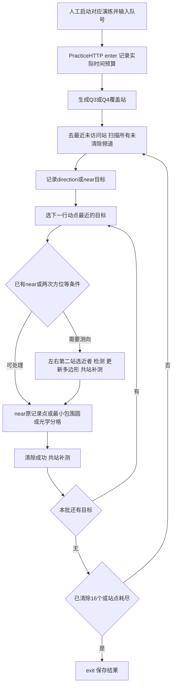

# 当前解法审计

审计日期：2026-09-11。对象是修改前的 `analysis_b` 及独立演练包，按用户任务文本执行第一轮。题目四页已提取并对照渲染图；附件按 OOXML 正文、表格和公式读取。附件是题目与协议资料，任务文本才是本轮工作指令。

## 审计范围与版本

逐一阅读 `analysis_b` 的19个 Python 文件，包括策略、模拟器、HTTP、测试、实验、打包和报告生成代码。独立演练包6个 Python 文件与研究目录对应文件逐字节一致，不存在另一个算法版本。修改前文件哈希清单在 `experiments/round1/original_manifest.json`，源码与配置快照在 `experiments/round1/baseline/`。原目录无 Git 仓库，故用快照保留稳定版。旧结果不覆盖。

## 当前方案的十四项核查

| 项目 | 实际实现与判断 |
|---|---|
| 1 问题1 | `bearing_halfplanes` 将每次示向度转成两个前向半平面；`polygon_from_halfplanes` 用LP区分空、无界、有界，再枚举边界交点；`diameter` 枚举顶点对。三角函数自然处理360°跨界。不是包围盒直径，也不是中心线交点。 |
| 2 问题2 | 报告给出保证全向接收的二维候选区域；代码固定前进650、侧移250米。shared/route在左右镜像中选择离狗近的点；没有按当前可行域做 minimax 优化。既有12点数值研究只输出直径和移动成本，缺面积、最小包围圆半径及交会角统计。 |
| 3 问题3 | 默认 `OptimizedPolicy(variant='shared')`。25站方格覆盖；本站扫描完未清除频道；按下一行动点最近原则调度目标；共站补测；最小包围圆或光学分格清除。 |
| 4 问题4 | 默认仍为shared，但用49站600米格网。具有独立的距离＋凸包方向覆盖证明。再次失联保留首测区域，用光学覆盖完成；没有示向度追踪或丢失信号恢复。 |
| 5 路线 | 每次从实际清除终点选择最近的未访问搜索站；不是固定蛇形全域巡查。光学格中心按列蛇形，可从较近端开始。 |
| 6 频道扫描 | 每站只扫尚未清除的频道，优先当前检测频道，其余升序。不存在逐频道提前排除证书，未发现频道一直扫到全域完成。 |
| 7 示向度定位 | 首测建立1500米长三角形外包扇区；新direction裁剪该多边形。未与1800米圆盘或精确接收圆求交，属于安全但较松的外包。tracks仅在当前站目标批次内保存，批次处理完清空。 |
| 8 clear条件 | `enclosing_circle` 枚举1/2/3支撑点候选并核验所有顶点。半径≤20−1e−6才做保证单次清除；否则25米格网中心清除。分格失败是预期，不是判定整个频道不存在。未发现把直径≤40直接当保证的错误。 |
| 9 不存在判定 | 无显式PROVEN_ABSENT状态。全部覆盖站处理完、所有已发现目标已清除，则剩余频道整体可判不存在；清除16个可按题目数量上界提前退出。不会清除10个就结束。 |
| 10 反馈 | no_signal不缩小定位域，第四问不由此删除源；direction累积半平面；near记录当前位置并最终在该点clear。初扫near仍等本站扫描完成，第二站near仍可能先执行shared_scan，因此并非总是立即clear。 |
| 11 时间 | `PracticeHTTP`、本地模拟器和逐动作验证器均按 L/5＋切换数＋5×测量数＋3×清除尝试数＋2×成功数计时；clear只更新位置、不切测向频道。拒绝响应不重置最近合法时钟。 |
| 12 HTTP | 默认PracticeHTTP按动作生成UUID前缀＋计数ID，超时原字节重试，串行、本地日志、现实剩余时长与虚拟预算检查。未知动作结果置uncertain，禁止不同后续动作。旧HTTPRobot没有同等未决保护，见P0。协议没有演练/正式识别能力，不能自动连接一个未知模式的会话。 |
| 13 数学假设 | 静止源、有界误差、闭180°半平面、接收半径1000至1500、20米确定性光学清除。1.005°是取整保守余量。均匀位置/数量/接收半径及半数定向、空间哈希误差仅为本地生成器假设。 |
| 14 启发式 | 650/±250、共站间距100、估计距离1300、交角正弦0.12、最多4次附测、3次正测停止、2次正测即可转光学、最近邻目标/搜索站。它们影响效率，不构成正确性证明；650/250在optimized.py硬编码，改config不影响默认shared的这两个参数。 |

## 运行流程

## 最大五项风险及优先级

1. **P0，条件性且限旧入口：旧 `http_robot.py` 在未决超时后仍可能发送新的exit。** `post`三次超时抛出TimeoutError，main捕获后只检查deadline并调用exit；前一measure可能已经执行但响应丢失。默认PracticeHTTP已防护。本轮保留旧版供对照，官方演练必须使用practice入口；下一次通信专项应删除旧入口歧义或补保护。
2. **P1：第三问25站过度覆盖。** 最坏最近站距离707.107米，大幅小于1000米；未发现频道在大量外侧站反复扫，尾部耗时显著。第一轮选这一项，只改搜索点集合。
3. **P1：第四问固定侧移后失联会退回长条光学穷举。** 正确性有兜底，但可能产生上百次清除尝试；方向覆盖49站的扫描成本也高。尚未比较追踪、短步推进或第三次测向，不把未做的实验说成改进。
4. **P1：near并非立即处理。** `run`初扫只记录near；`update`后可能先共站测量再finish。真源仍静止，返回原near点可成功，因此目前没有由此推导漏源，但可能发生不必要绕行和延迟。列为下一轮低风险候选。
5. **P2：参数、问题2证据与版本可追溯存在缺口。** shared硬编码第二站参数，参数扫描易测错对象；既有Q2缺面积/MEC半径；旧报告有“尚未联调”等历史描述，不能当当前状态；`build_report.py`会把当前代码哈希写进旧环境结果而不重跑实验，可能错误归属旧数值。保留原文件与历史结果，本轮新实验单独记录哈希。

附加P2：没有统一入口检查所有物理/策略配置的证明前提；光学格距若误改到大于20√2、第四问格距大于1000/√2，保证可能失效。现行默认值满足。MEC穷举复杂度O(k^4)，目前顶点少，无需为代码美观重写。

## 关键数学结论

问题1同直径圆一般不能覆盖：40米正三角形的最小包围圆半径40/√3≈23.094米。原代码已有由真实楔形交集实现的反例。退化与跨界还会在本轮测试复核。

第三问旧格网：每坐标最近格点误差≤500，距离≤500√2。第四问：任一点属于600米闭方格，四顶点距离≤600√2≈848.528；该点在四顶点凸包中。对任意发射向量d，凸组合的d·(顶点−源)等于0，故至少一个非负，满足含边界180°可见条件。这个结论在边界也成立，无需“严格内部”；不能删去圆外辅助站后仍照搬证明。

首测三角形是正确扇区外包，格距25米对应覆盖半径17.678米，因而光学兜底在题设下成立。数值容差和现实网络时限另需验证，有限离线全清除不代替这些证明。

## 第一轮实验预注册

仅改变Q3搜索点集合：圆心＋半径1800cos30°的六个等角点；Q4、定位、clear、频道与HTTP逻辑不变。证明覆盖半径900米。旧版快照作为baseline；新增独立随机种子2026091100起100例，另开发20例、三类压力各10例、Q4配对回归10例。记录全部失败与退步；所有源必须清除并通过逐动作/几何核验，验证均值须改善才KEEP。仅比较这两个版本，不凭验证集继续调参。

未发现默认2026端口监听；未发送官方HTTP动作。没有当前演练模式、队号和案例编码证据，真实演练留待人工启动并提供信息。第一轮离线完成后停止新增优化。
