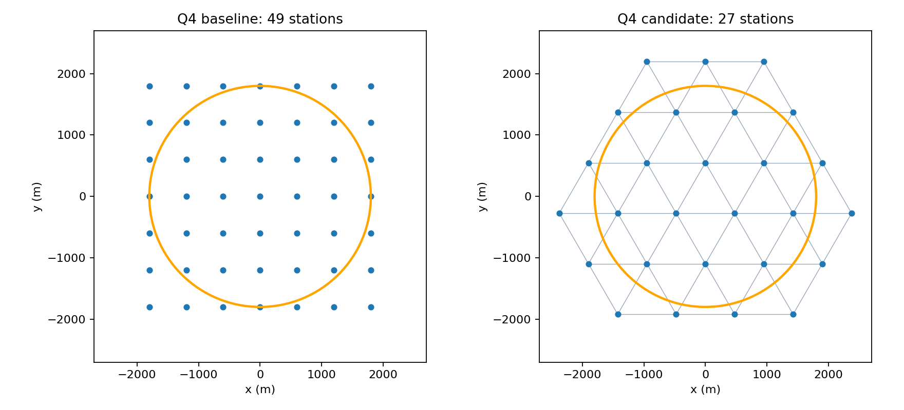

# Experiment 2：问题 4 三角网格候选验证报告

执行日期：2026-09-11。结论：离线验证支持进入真实演练；当前是候选版，尚未判定最终 KEEP。

## 已交付的修改

- B题演练程序/model.py 和 analysis_b/model.py 同步加入问题 4 专用三角网格。
- 两份 config.json 已设置 q4_survey_layout 为 triangular、q4_triangle_spacing_m 为 950，下次运行问题 4 将使用 27 站候选。
- 旧 49 站保留：将演练目录配置中的 q4_survey_layout 改为 grid 即可切回；q4_grid_m 仍为 600。完成对照演练后再改回 triangular。
- 问题 3 保持中心加六环点、环半径约 1558.85 米。optimized.py、定位、清除、共享测站和 HTTP 实现均未改动，没有加入新追踪策略。
- 本地基线标签：q3-frozen-before-q4-triangle-20260911，指向 6a7b0ce4630048a110b1a986779955a671773769。源码快照及 SHA-256 在 experiments/round2/baseline/ 和 baseline_manifest.json。

## 本次实际测得结果

下表先计算每局虚拟总时间/该局真实源数，再对案例取算术平均；两版所有源均已清除。时间单位为虚拟秒/源。

| 数据集 | 配对案例 | 49站 | 27站 | 降幅 | 每版清除数 | 退步案例 |
|---|---:|---:|---:|---:|---:|---:|
| 问题4普通验证 | 100 | 928.46 | 767.64 | 17.32% | 1310/1310 | 5 |
| 问题4压力验证 | 50 | 916.49 | 727.66 | 20.60% | 670/670 | 2 |
| 问题3回归 | 10 | 314.38 | 314.38 | 0.00% | 140/140 | 0 |

共 160 对、320 次本地运行。问题 4 为 150 对，每一版均清除 1980/1980 个源。问题 3 额外验证 10 对、140 个源，逐动作序列哈希逐例完全一致。

| 普通验证集指标 | 49站 | 27站 |
|---|---:|---:|
| 平均秒/源 | 928.46 | 767.64 |
| P95秒/源（案例均值的95分位） | 1247.55 | 953.58 |
| 合并总时间/总源数 | 900.82 | 749.88 |
| 平均访问站数 | 46.09 | 25.98 |
| 平均测量次数 | 450.38 | 274.39 |
| 平均动作数 | 570.07 | 382.51 |
| 平均移动距离/米 | 43773.20 | 39242.16 |
| 平均清除尝试次数 | 119.69 | 108.12 |

配对平均节约为 160.82 秒/源；5000 次配对 bootstrap 的均值节约 95% 区间为 [140.06, 180.79] 秒/源。这仅描述本地生成分布。

以上是本次代码、固定网格对齐与遍历顺序下重跑的结果，并非直接沿用此前临时试验的 749.78 秒/源或 19.36%。网格平移和站点顺序会改变贪心路线、测点及后续观测，历史数字不能视为本次实现的精确预测。

## 不利案例与原因

| 集合 | 种子 | 场景 | 49站秒/源 | 27站秒/源 | 增加秒/源 |
|---|---:|---|---:|---:|---:|
| holdout | 20270941 | random | 420.45 | 509.64 | 89.19 |
| holdout | 20270949 | random | 414.02 | 506.28 | 92.26 |
| holdout | 20270976 | random | 478.80 | 673.93 | 195.13 |
| holdout | 20270977 | random | 447.10 | 499.11 | 52.01 |
| holdout | 20271003 | random | 379.62 | 480.27 | 100.65 |
| stress | 20280912 | radius_min | 655.72 | 668.83 | 13.11 |
| stress | 20280914 | radius_min | 516.85 | 583.16 | 66.32 |

最坏案例 20270976 含 16 个源，旧版在第 18 个站达到 16 源上限并提前结束，新版要访问 25 个站。移动距离从 29149.09 米升至 43649.60 米，增加的移动耗时约 2900.10 秒，占总时间增加 3122.10 秒的约 93%。清除尝试反而从 183 次降至 176 次。因此总搜索站更少并不保证每局路线更短，不能把该退步简单归因于光学穷举。

压力集的平均清除尝试为 135.16 → 135.76 次，基本没有改善。第二测点失联后的光学搜索短板仍然存在，应留到 Experiment 3 单独研究。

## 27站构造与连续覆盖证明

设三角形边长 s=950 米、高 h=√3·s/2。无限网格顶点定义为 v(i,j)=(s·(i+j/2)−s/2, h·j−h/3)，其中 i、j 为整数。

每个菱形拆成两个闭等边三角形：[(i,j),(i+1,j),(i,j+1)] 与 [(i+1,j),(i+1,j+1),(i,j+1)]。一个三角形的重心位于目标圆心。保留所有与半径 1800 米闭圆盘相交三角形的顶点并去重，得到 27 站。若用网格顶点对齐圆心，同样规则会得到 31 站，因此对齐方式是方案定义的一部分。

相交判断使用“圆心在三角形内，或圆心到任一边线段的距离不超过圆半径”，包含相切，并留微小数值容差。枚举范围在圆的包围盒外多覆盖一个完整网格单元，避免漏掉跨边界三角形。

任意源 x 位于某个被保留的三角形，写成 x=λ₁v₁+λ₂v₂+λ₃v₃，其中 λᵢ≥0、Σλᵢ=1。三角形直径为 950 米，所以三个顶点与 x 的距离均不超过 950 米，距最小接收半径 1000 米有 50 米余量。

对任意单位发射方向 u，有 Σλᵢ·u·(vᵢ−x)=0。若所有顶点都在发射背面，每个 u·(vᵢ−x)<0，其凸组合不可能为零。因此至少一个顶点位于发射的闭前半平面，且处于接收范围内。源恰好重合于顶点时该站可触发 near。结论依赖题目/本地模型采用闭前半平面的定向接收规则，以及允许机器人到目标圆外测量；不可删除圆外站点。

证明给出连续圆域和任意朝向的保证；离散检查只是实现复核，不代替证明：

- 检查 43,409 个位置，包含 20 米笛卡尔网格、7200 个圆周角度、贴近圆周内侧、三角形边与顶点、1000 米接收阈值。
- 所在三角形缺失顶点数为 0，方向覆盖反例数为 0。
- 测得顶点最坏距离 950.000000000000 米（微差为浮点误差），最大方向间隙 151.71426°。
- 额外通过 36 个边界源位置 × 36 个发射朝向的实际本地测量接口验证，以及相切单元保留测试。

## 实验设计与验证范围

- 普通验证：种子 20270910–20271009，100 例；压力验证：20280910–20280919，每种场景各 10 例，包含边界朝外定向、中心聚簇、最小接收半径、全部朝外定向、平滑误差随机场景，共 50 例。
- 使用项目既有生成器和既有验证种子，固定后直接重跑，没有按结果筛选案例，也不称为新的盲测集。与真实比赛分布的差异须通过实际演练评估。
- Q3 回归种子 20290910–20290919；两份配置下完整动作哈希完全一致。原函数与 Policy 的 AST 除 survey_points 分派外相同，optimized.py 与 simulator.py 的 SHA-256 与基线一致，演练和分析目录对应文件逐字节一致。
- 每个动作重算时间、核对成功清除距离、验证定位证书包含真源，并检查总清除数。原 15 项与新增 5 项测试全部通过，共 20 项。
- 本地 HTTP 测试 Q3：10/10 源、4144.269191 秒、132 动作；Q4：10/10 源、9352.777510 秒、429 动作。本机临时测试服务不是官方模拟器。

## 真实演练与下一步

本轮官方演练次数为 0，未连接官方模拟器，也未消耗正式机会。推荐顺序中的“旧版1次、新版3–5次真实演练”尚未完成，因此当前仅供下一轮演练，最终 KEEP 仍待真实数据。

先把演练目录 config.json 中 q4_survey_layout 临时设为 grid，跑一次问题 4 基线；再设回 triangular，跑 3–5 次。每次记录案例编码、界面真实源总数、定向源数和完整日志。若无法用相同案例配对，应明确不同案例带来的波动；不要仅凭一局对比判优。

启动器目前仍未自动采集案例编码或真实源数；practice_robot.py 已支持 --case-code，但 clearance_ratio 仍需真实源数才能填写。本轮仅改搜索布局。正式测试前仍需单独完成启动器案例输入和明确的正式模式二次确认，不能把现有提示当成协议已识别模式。

问题 3 不继续调参；1150 米环半径和问题 4 失联追踪留作后续独立实验。没有创建 PR 或推送，也没有删除历史记录。

## 文件与复现

- 本报告：docs/experiment2_report.md。
- 实验入口：analysis_b/experiment2.py；新增测试：analysis_b/test_round2.py。
- 配置、案例清单：experiments/round2/specification.json。
- 逐局数据：experiments/round2/paired.csv；逐动作日志、源真值和定位证书：actions.jsonl.gz。
- 汇总：summary.json；退步案例：regressions.json；几何复核及坐标：geometry.json；环境及代码哈希：environment.json；测试记录：validation.json。

在 analysis_b 目录执行 python -B -m unittest test_round1 test_round2 test_http test_practice -v 可复验测试。python -B experiment2.py 可重跑完整实验，但脚本会拒绝覆盖已有结果；应先明确另存旧 round2 结果再运行。
