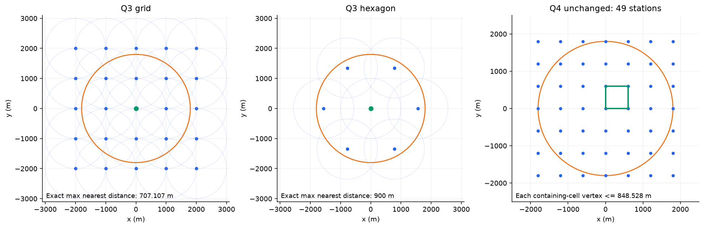
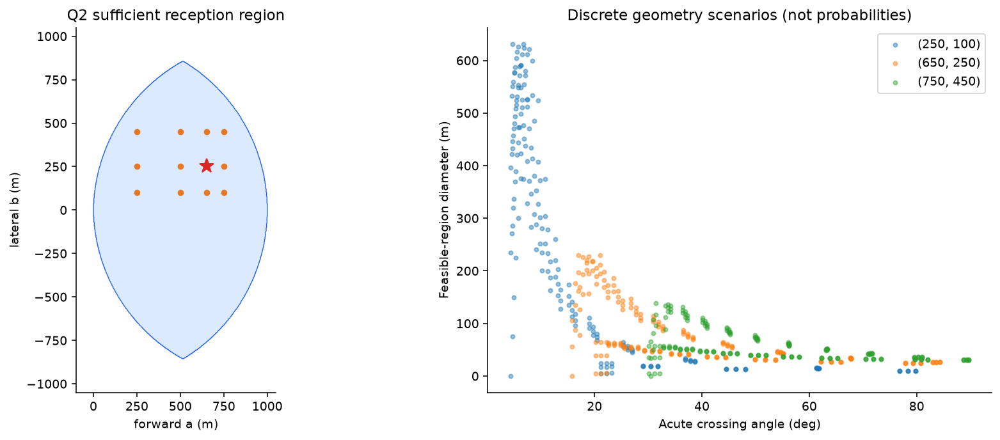
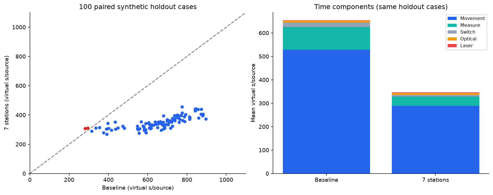
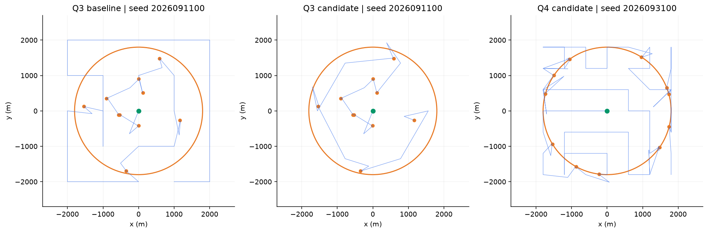
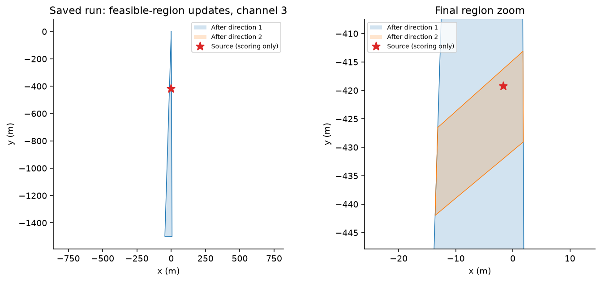

# 第一轮实验汇总

结论：KEEP第三问7站搜索。对照为现有shared优化版，不是更早的triangulate。只变搜索点集合，定位、光学兜底、频道、HTTP与第四问保持原策略。本轮完成后停止继续优化。

## 修改前后

| 数据集 | 配对案例 | 旧版秒/源 | 新版秒/源 | 降幅 | 旧/新全清除 |
|---|---:|---:|---:|---:|---|
| 第三问开发集 | 20 | 658.10 | 336.68 | 48.84% | 261/261；261/261 |
| 第三问独立验证集 | 100 | 654.53 | 346.62 | 47.04% | 1308/1308；1308/1308 |
| 第三问压力集 | 30 | 624.93 | 312.64 | 49.97% | 395/395；395/395 |
| 第四问回归集 | 10 | 1154.37 | 1154.37 | 0.00% | 127/127；127/127 |

共160对、320次离线运行。每版累计2091个源均清除；第三问每版1964个、第四问每版127个。100个独立验证案例的单局T/清除数再平均，得到654.53→346.62秒/源；不是先合并所有时间再除总源数。平均下降47.04%，98例改善、2例退步。单局总虚拟时间均值8292.90→4466.31秒，降幅与平均秒/源略有不同。

验证集平均移动距离33580.40→18653.61米，平均测量次数243.17→101.66，频道切换222.97→97.51，清除尝试37.28→34.54，失败清除24.20→21.46。主要收益来自搜索路线缩短和尾部扫描减少，不是改变清除判据。

P95为872.27→430.66秒/源；配对bootstrap的平均节约95%区间为[284.37, 329.86]秒/源，5000次重采样。该区间仅针对本地生成分布。

## 不利案例

- local-3-2026091140-random：295.43→309.67秒/源，增加14.23。
- local-3-2026091166-random：281.87→306.70秒/源，增加24.82。

这两例未删除，完整日志和分项计时均保存。当前贪心路线与不同测站观测会改变目标处理顺序及局部误差；7站不是逐例必胜，也不声称最优。

## 正确性证据

- 七站连续域最坏覆盖距离精确为900米，留100米接收余量；421474个空间检查点得到900.0000000000005米，差值为浮点舍入。旧方案精确上界707.107米。
- 第四问49站有闭凸包方向覆盖证明；39846个位置检查最大方向间隙≤180°，反例数0。七站用于第四问会漏掉边界朝外源，已有明确反例，因此禁止套用。
- 每个离线动作重算计时，全部成功清除距离≤20米，多边形与包围圆都含真源，清除数等于真值，虚拟时间在限制内。
- 第四问10个新案例的完整动作序列哈希逐例一致，不只是总时间相同。
- 原版10项测试通过；最终15项通过，涵盖真实回环HTTP、四动作响应丢失重试、拒绝时钟、预算、角度跨界、空/无界/点/线段、三角形反例、七站极值和定向边界。
- 最终Q3回环HTTP固定测试案例10/10，4144.269191虚拟秒、132动作；原25站为8672.846287秒、372动作。Q4仍为12927.693634秒、743动作。此服务是本机临时测试服务，非官方模拟器。

## 覆盖与第二问核查

只走搜索站、不插入定位任务的最近邻几何路线：25站24000米，7站9353.07米。若每站检测全部20频道，检测数500→140；相应无目标纯巡查成本7775→2703.61秒。这里是假想路线成本，不是题设10至16源的实际成绩，不纳入案例均值。

第二问补齐12候选点×189情景的面积、直径、MEC半径与交角。650/250候选的情景最坏面积4201.00平方米、直径230.30米、MEC半径115.15米，移动139.28秒；750/450的相应值2651.49、138.06、69.03和174.93。说明定位尺寸更小可能增加移动成本，尚不能仅据此替换第二测点。

本轮没有参数扫描或多策略追踪实验。环半径来自解析证明，不是调种子；固定第二站和共站阈值的灵敏度仍待后续单独研究。

## 图与数据

案例级总表：`experiments/results.csv`；逐动作日志：`experiments/round1/baseline_logs.jsonl.gz`与`candidate_logs.jsonl.gz`；汇总、退步案例、环境哈希、覆盖验证、Q2逐情景值均在同目录。图由这些保存结果生成。

## 真实演练状态

检查时默认2026端口没有监听；未获得当前演练模式、队号与案例编码，也未发送官方HTTP动作。需要启动一次演练测试，人工核对对应问题的演练模块并提供队号和端口；结束后补录真实源总数。没有伪造官方结果，没有消耗正式测试机会。

## 下一轮建议

Experiment 2建议只研究第四问方向覆盖搜索点与路线：49站依旧保守，可在保持“近距离测站凸包包含任意源”的证明条件下比较三角网格或含区外点的候选。先做连续证明和反例搜索，再与当前版配对；暂不同时修改定位追踪。更小的修复项是near即时clear，可单独成轮，不混入覆盖收益。
